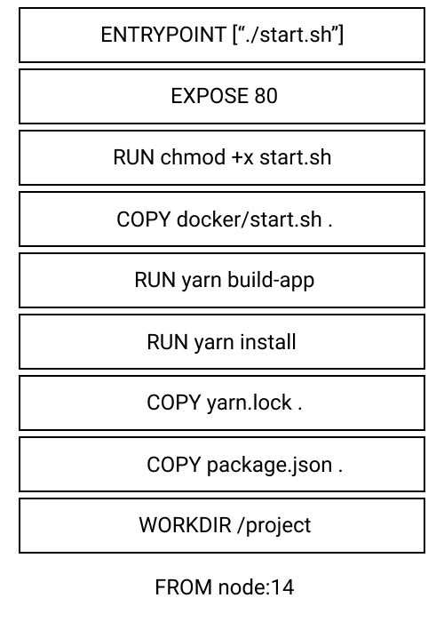

+++
title="Day-12, Things learned after spending time with docker"
date=2021-08-11
+++

# Preface

I been spending time learning about docker and trying to dockerize a project. These are some points/tips that I didn't find explained properly in a lot of guides and articles. Got to know most of these from [Mukul Mehta](https://mukul-mehta.in) (don't be surprised if you find his blog theme similar to mine, it was the other way around).

## EXPOSE isn't exposing

One thing that I realized after reading a few articles was how much people mix up the EXPOSE instruction. Some writers tend to overuse the word expose which makes beginners feel as if just writing `EXPOSE 80` "exposes" the port, which makes someone think that they can now connect to port 80 of the container from outside. But it doesn't.

EXPOSE is mainly a way of documenting in a dockerfile. The better term would be "publishing" a port. The `-p` flag added while running a container is to publish or bind an exposed port to any port of the host machine. Most of the times, while running a container we tend to "map" the published ports to a specific port.

```bash
docker run -p 8000:80 <image_name>
```

Running this command publishes port 80 of the container and maps it to port 8000 of the host machine.

## DOCKER BUILDKIT

Building images takes time. A lot of time.


[Docker Buildkit](https://github.com/moby/buildkit) has been a recent addition ([2017 blog introducing it](https://blog.mobyproject.org/introducing-buildkit-17e056cc5317)) and is something which can be used to reduce the build times.

They mention the following as their key features on their repository:

- Automatic garbage collection
- Extendable frontend formats
- Concurrent dependency resolution
- Efficient instruction caching
- Build cache import/export
- Nested build job invocations
- Distributable workers
- Multiple output formats
- Pluggable architecture
- Execution without root privileges

You can use it by adding `DOCKER_BUILDKIT=1` in your docker build command. I didn't find any articles checking how much time it saves due the features mentioned above, hence I would it myself someday.

## Get good at organizing layers

The key to writing good dockerfiles is to position intructions with frequent changes as low as possible. What this means if I have the following dockerfile:

```Dockerfile
  FROM node:14
  WORKDIR /project

  COPY package.json .
  COPY yarn.lock .

  RUN yarn install
  RUN yarn build-app

  COPY docker/start.sh .
  RUN chmod +x start.sh
  EXPOSE 80
  ENTRYPOINT [ "./start.sh" ]
```

And I make any changes to the `start.sh` script and make a build again, docker uses the cache from previos build and rather than going through the whole process of installing all the packages it starts from `COPY docker/start.sh`. The opposite would have happened if I had copied the script above `RUN yarn install`.

Docker layers are stacked on top of each other and they are all read-only, with the exception of the topmost, writable layer. Each instruction is a separate layer, hence it's good to combine commands using something like `&&` or putting them inside a script and running that instead. The layers for the above dockerfile can be represented like this:



Making a change in any layer would make docker build start from that layer to the top.

## [TIP] No need to write the complete image id

Stopping a container would be done very frequently while development. To see what containers are running you run:

```bash
docker ps
```

This prints out an output similar to below:

```bash
CONTAINER ID   IMAGE          COMMAND        CREATED       STATUS       PORTS                  NAMES
22528c8e2d2b   neera:latest   "./start.sh"   2 hours ago   Up 2 hours   0.0.0.0:8000->80/tcp   laughing_williams
```

After which I used to copy the container id and paste it in the command:

```bash
docker stop <container_id>
```

Turns out if there aren't anything with similar id all one can do is write the first 1-2 letters of the id in docker stop and it does the same thing.

Hence, writing `docker stop 22528c8e2d2b` and `docker stop 22` does the same thing, till there are no other containers starting with 22. Can't believe I am saying this but

```txt
  Life is too short to write full container ids
```

## Refrences/Interesting Reads

- [Beginners guide to Docker](https://www.learncloudnative.com/blog/2020-04-29-beginners-guide-to-docker?utm_source=pocket_mylist)
- [Docker -t flag / pseduo-TTY](https://stackoverflow.com/questions/30137135/confused-about-docker-t-option-to-allocate-a-pseudo-tty?utm_source=pocket_mylist)
- [Container names generator function](https://github.com/moby/moby/blob/master/pkg/namesgenerator/names-generator.go)
- [What even is a container](https://jvns.ca/blog/2016/10/10/what-even-is-a-container/?utm_source=pocket_mylist)
