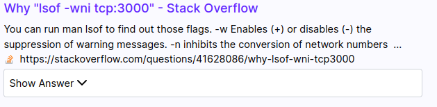
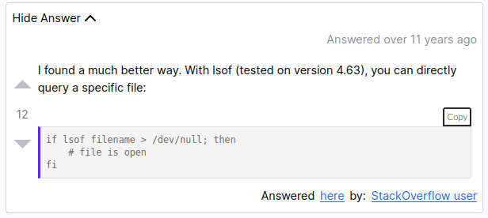

+++
title = "Day-2, Adding Copy to Clipboard Button to Codeblocks"
date = 2021-08-02
+++

Around two months ago I had an opportunity of adding a copy to clipboard button for all codeblocks on a page. This is how I went about it.

# About the problem

Search results on [Neera](https://neera.ai) are unique in a way that we show the top answer of all Stackoverflow questions when they are showed on the results.

This is how they look when the page first loads:


Once can click to see the answer:


This was an easy method to quickly get the accepted/most upvoted answer on Stackoverflow.

We did this by making a server which had the archive of all of Stackoverflow. We sent this server all the question id after after search and in return we received top answers of all the questions.
More explained about how we set this up and put such a large archive in database [here](https://hargup.substack.com/p/lab-notebook-creating-a-stackoverflow).

## Okay, so what are we working on?

Stackoverflow doesn't have the feature of copying the contents of a multi-lined codeblock. We wanted to add this button to our answers previews.

## First things first

I first inspected and saw a `pre` tag is put before the usual `code` tag when it comes to multi-lined codeblocks.

```html
<pre>
  <code>	
   ...
  </code>
</pre>
```

I dind't want a copy button when there is a single word or a few words of code, which is similar to single backticks in the case of markdown.

Hence, I targeted the content of only those `<code>` tags that resided inside `<pre>` tags.

## Too much talk, let's code now

This is the first iteration of code I wrote, after getting help from [this article](https://www.dannyguo.com/blog/how-to-add-copy-to-clipboard-buttons-to-code-blocks-in-hugo/).
This used JavaScript [Clipboard API](https://developer.mozilla.org/en-US/docs/Web/API/Navigator/clipboard).

```javascript
function addCopyButtons(clipboard) {
  document.querySelectorAll("pre > code").forEach(function (codeBlock) {
    var button = document.createElement("button");
    button.className = "copy-code-button";
    button.type = "button";
    button.innerText = "Copy";

    button.addEventListener("click", function () {
      clipboard.writeText(codeBlock.innerText).then(
        function () {
          button.blur();
          button.innerText = "Copied!";

          setTimeout(function () {
            button.innerText = "Copy";
          }, 2000);
        },
        function (error) {
          button.innerText = "Error";
        }
      );
    });
  });
}
```

I put the code above in the `useEffect` hook, as we use React for our frontend. This would add the buttons just when the page renders.

Happy with what I had written till now, I tried looking at what it looked like and to my surprise there was no button to be found :|

## What is happening? or to be exact why is nothing happening?

Let's go over the code once again, line by line this time.

- This would get all the content inside a code tag that exists inside a pre tag **throughout the page**

  ```javascript
    document.querySelectorAll("pre > code").forEach(function (codeBlock)
  ```

- This creates a button with the `className` (instead of `class` because it's React) and adds the text "Copy" inside of it

  ```javascript
  var button = document.createElement("button");
  button.className = "copy-code-button";
  button.type = "button";
  button.innerText = "Copy";
  ```

- This adds a click function while adding the button inside the codeblock. After clicking the button the text inside changes to "Copied!" which changes back to "Copy" after 2000 miliseconds. Also, it displays if any error encountered.

  ```javascript
  button.addEventListener("click", function () {
    clipboard.writeText(codeBlock.innerText).then(
      function () {
        button.blur();
        button.innerText = "Copied!";

        setTimeout(function () {
          button.innerText = "Copy";
        }, 2000);
      },
      function (error) {
        button.innerText = "Error";
      }
    );
  });
  ```

While I know I didn't go over "line by line", but I still don't see any issue. Do you?

So after spending 20 minutes looking figuring out where I was going wrong in the developer tools, I realized the issue.

Remember how the results look when results first render? and remember how I used `useEffect` and how it worked just when the page renders?

# Is this supposed to be the point I understand things?

So, here is what's happening:

- Just when the page renders, the function to add buttons throughout the document runs.
- But, as the answers are closed at the start the answers aren't part of the document.

  - This is how it looks when I insepect the closed answer body

    ```html
    <div>
      <div>
        Show Answer
        <svg ...>...</svg>
      </div>
    </div>
    ```

  - This is how it looks when I open the answer

    ```html
    <div>
      <div>
        Show Answer
        <svg ...>...</svg>
      </div>
    </div>
    <div>
      <p>Answered over 4 years ago</p>
      <div>
        <div>
          <p>You can run <code>man lsof</code> to find out those flags.</p>

          <p>
            -w Enables (+) or disables (-) the suppression of warning messages.
          </p>
          ...
        </div>
      </div>
    </div>
    ```

# Explain to me like I am 5 (not really, but you get the point)

The point I am getting at is that, till I open the answers they aren't a part of the document and even when I do open the answers the function to
add buttons has already finished running. **Hence, the reason there were no buttons is that there were no codeblocks at that time**.

## What now?

So now to solve this problem I had to make the function run at the same time the button is clicked to expand the answer, that should be enough right?

Nope.

It didn't work, I figured that this could be due to a delay in adding the answer DOM to the document, but the function started running before. Hence I made the function run after a small delay of 50 miliseconds (I think we can go lower than this).

```javascript
  onClick={() => {
    setShowAnswer(!showAnswer);   // This boolean expands or collapses the answer
    setTimeout(() => {
      addCopyButtons(navigator.clipboard);
    }, 50);
  }}
```

This did what I wanted it to do.

## A little bit of styling please

Then I wrote a bit of css to do the following:

- To position the button on the top right corner of a codeblock
- Change the colour on hover and while it's active. Nothing special.

```css
.copy-code-button {
  color: #272822;
  background-color: #fff;
  border-color: #272822;
  border: 2px solid;
  border-radius: 3px 3px 0px 0px;

  display: block;
  margin: 0.25rem 0rem 0 auto;
  padding: 0.2rem;
  font-size: 0.8em;
}

.copy-code-button:hover {
  cursor: pointer;
  background-color: #f2f2f2;
}

.copy-code-button:focus {
  background-color: #e6e6e6;
  outline: 0;
}

.copy-code-button:active {
  background-color: #d9d9d9;
}
```

# The Result


