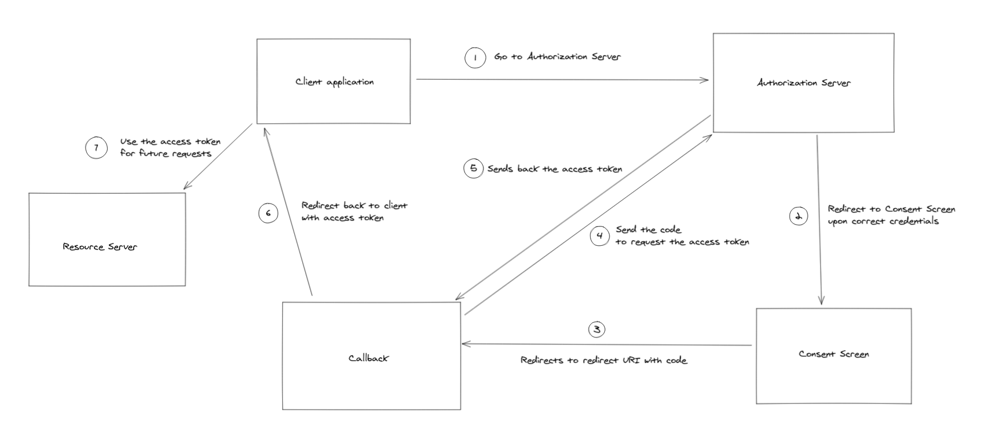

+++
title = "Let's Learn About OAuth!"
date = 2021-06-21
+++

It's been a few weeks since I been implementing OAuth to integrate different kinds of searches for services like [Pocket](https://getpocket.com/), [Notion](https://developers.notion.com/) and [Drive](https://developers.google.com/drive/api/v3/about-sdk) for [Neera](https://neera.ai/). This is a way of documenting everything I have done/read till now.

## Basics First

Suppose you want to make an application which searches through drive files and folders for different users. How do you go about giving your application access to a user's files? 

- Do you directly ask your user to give their credentials to you? So that you can those to get their files yourself.

Technically, that would work. But a lot of people wouldn't give you their credentials, if not all. 

- Or you can ask the user to give a limited access to their files, through which the application can interact with Drive on your behalf. This would only involve the user proving their identity to Google without sharing any credentials to you. 

This is what OAuth does. It is the **authorization of two services** so that they can interact on their own, on preset terms which the user agrees to. 

OAuth stands for Open Authorization. It's a process through which an application or website can access private data from another website without having to make the user give any kind of sensitive information to third party websites.

This is also the process you go through when you choose to sign up with your Google or Facebook account while signing up for something else. Just remember how you get redirected to a familiar login when signing up, after which you get back to where you started. 

## History Second

The idea behind OAuth began in November 2006, when few engineers met to discuss about Twitter OpenID and Ma.gnolia APIs. They concluded that there were no open standards for API access delegation. 

Later an OAuth discussion group was created, which was joined by multiple people who coordinated the contributions creating a more formal specification. 

All of these efforts led to further standardization and hence on 2010, OAuth 1.0 protocol was published and later OAuth 2.0, which we use today and would mostly discuss, was published in 2012. 

## Terminology Third

- **User**: The user is who authorizes an application to access their account. 
- **Client**: The client is the application that's trying to access the user's account. 
- **Scope**: It specifies the level of access that the application is requesting form the client. The application's access to the user's account is limited to the scope of authorization granted (eg. read or write access)
- **Resource Server**: This is the server which contains all the resources. It only returns data to authenticated requests. 
- **Authorization Server**: This server validates the user's credentials and redirects the user to the consent screen, which is the place the user is informed about the scopes the client application is requesting. On acceptance, the user is redirected back to to client with an access token. 
- **Access Token**: This is token which is given after the OAuth is completed by a user. This token should be present in every request made by the client, and it is the way the resource server confirms that the authorization has taken place.
- **Redirect URI**: This is where you would be redirect to once the user accepts everything in the consent screen or when the OAuth is completed.

## It's Authorization Time

The OAuth workflow may look complicated, hence let's divide the whole process into steps and analyze each step. I tried making a flowchart to explain the whole process. 



### But, wait 

Before you can begin the OAuth process in your application, you must register it with the service. Few examples of this service can be Drive, Notion and Pocket. 

This is necessary as it tells the company about your application. Usually, you would be required to give information such as application name, website, a logo etc. You would also be required to tell the redirect uri(s), scope(s) etc. 

1. This step mostly involves the user clicking on a button which has a link with the following parameters: 

```
https://authorization-server.com/auth?response_type=code&client_id=CLIENT_ID&redirect_uri=REDIRECT_URI&scope=read
```

- **response_type=code**: This indicates to the authorization server that your server expects to receive an authorization code/access token.
- **client_id**: This a code that you get when you first create an application
- **scope**: One or more scopes

2. When redirected to this page, you would be welcomed by the login screen which later would take you to the consent screen. If you are already logged in, you would be seeing the consent screen directly.  
3. Once given the client application is given the permission, the user would be redirected back to the redirect URI with a code. This is where we put a "middle screen" which I named callback. 
4. This is the screen where you tell the user that you are redirecting them back to the place they started, but you are also sending a request back to the authorization server with the code. This request is made to get the access token. 
5. Once the above request is successful, the user is redirected back to the where you want, and this time with the access token. This access token needs to be attached to the headers or as query parameter of all the future requests from the client to the resource server.

## A Few differences

The access token is generally supposed to be valid for a limited time, this brings the question of what to do when the access token expires? 

Rather than going through the whole process of authorization once again, the client also receives a token called **refresh_token**, this token is mostly sent only for the first time an OAuth is done and needs to stored. 

When there is a limited life to access tokens, the client needs to send the refresh token with the access token to handle the case when the access token is expired. The resource server then "refreshes" the access token and uses the same for the original request. 

Among the three services I have been working with, drive is the only one which sends an access token with a limited life. 

# Bonus Section 

## Pocket authorization differences

Pocket's [developer docs](https://getpocket.com/developer/) mention that 

> "The Pocket Authentication API uses a **variant** of OAuth 2.0 for authentication". 

The word "variant" is important here. For making an application which uses an user's pocket's data, you first have to obtain a **request token** which is added as a parameter in the link of the button you click in step 1.  After accepting on the consent screen, you are once again given a code and redirect to your callback screen through which you get your access token. 

## OAuth 1.0 vs OAuth 2.0

The differences between the two types of OAuth was one the first questions that popped in my mind when I read that OAuth 2.0 is a complete rewrite of OAuth 1.0. I will try to go over few of the differences.

### Support for non-browser based applications

OAuth 1.0 had a lack of support for non-browser based clients. But, OAuth 2.0 used a different flow for authorizing a client which made it easier/possible for non-browser clients. This was on the of main advantages of OAuth 2.0 over OAuth 1.0.

### Ease of Implementation

OAuth 1.0 was often criticized for the barrier it posed to writing a client. There is a shared secret that is used to sign the arguments for the authorization request by the client, which also need to be passed in the exact order. 

OAuth 2.0 got rid of all signatures and cryptography at the protocol level, so as to rely solely on TLS. People did bring up concerns regarding the same, mentioning reasons such as yet-undiscovered zero-day TLS vulnerabilities which can potentially comprise the entire system.

### So what does the above mean?

All of the above doesn't mean that OAuth 1.0 is obsolete and that everyone should to move to OAuth 2.0. There are still a lot of companies which continue using OAuth 1.0 or a variant of it (OAuth1.0a for Twitter). 

OAuth 2.0 is also not necessarily more secure than OAuth 1.0, there are a lot of things which much be checked when working with OAuth 2.0 to prevent any harm to security. Like making sure the redirect URI is validated, and that access tokens don't end up in the browser history. There is also a [document by IETF for best current practices for OAuth 2.0 security](https://tools.ietf.org/id/draft-ietf-oauth-security-topics-10.html).  

I also landed about [an article by one the the original authors of OAuth 2.0,  Eran Hammer](https://gist.github.com/nckroy/dd2d4dfc86f7d13045ad715377b6a48f), in which mentioned a lot of flaws of the system compared to OAuth 1.0 which led to him withdrawing his name from the specification. He mentions his concerns in the end by writing: 

> "I think the OAuth brand is in decline. This framework will live for a  while, and given the lack of alternatives, it will gain widespread  adoption. But we are also  **likely to see major security failures in the next couple of years**  and the slow but steady devaluation of the brand. It will be another hated protocol you are stuck with."

But he also mentions that

>  "OAuth 2.0 at the hand of a developer with deep understanding of web security will likely result is a secure implementation"


